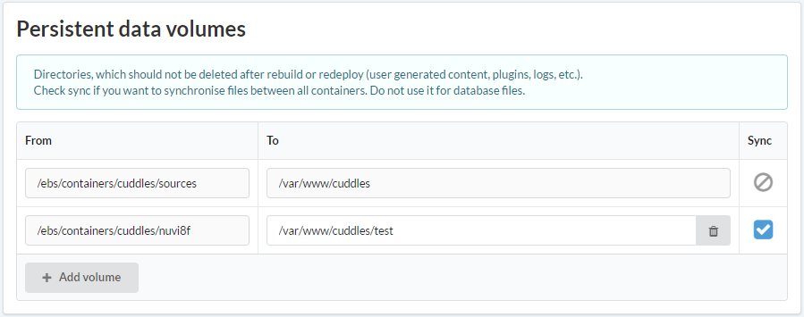
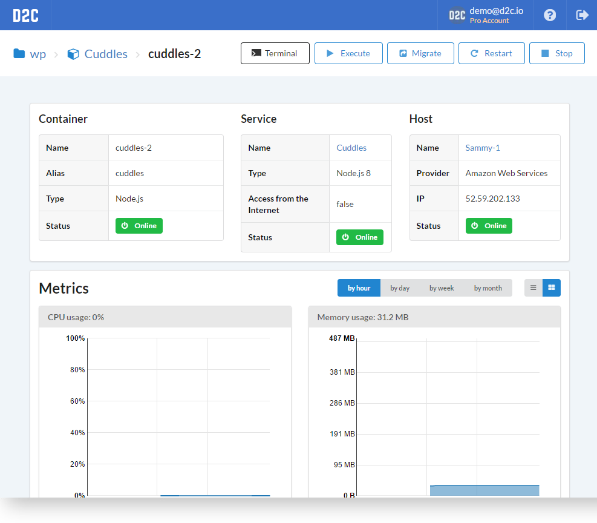
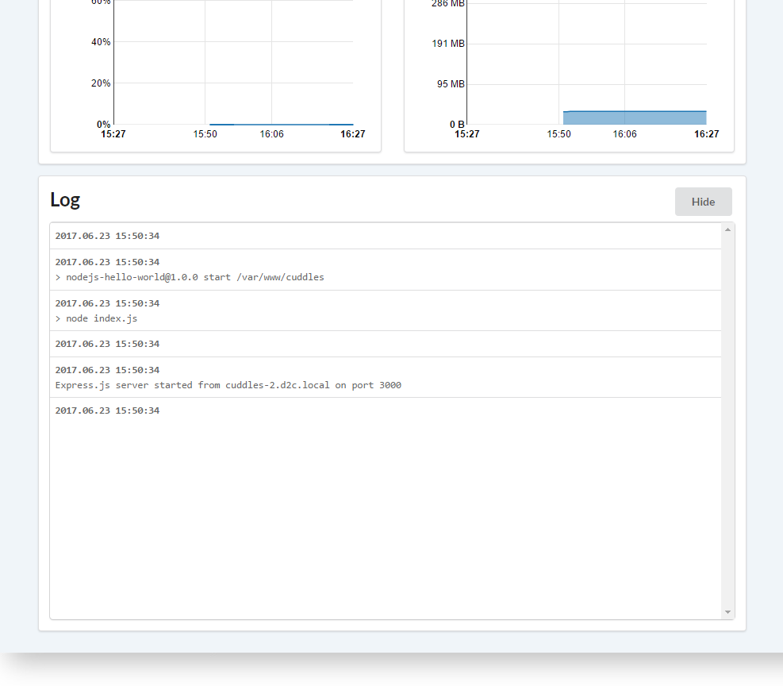

# Вступление

В Интернете достаточно много подробной информации о Docker containers. Предлагаем ознакомиться со  [статьей](https://www.docker.com/what-container) с официального сайта Docker.

## Постоянное хранилище

Приложения внутри контейнеров должны быть легковесными, доступными и легко заменимыми. По этой причине D2C разделяет приложение от данных приложения. Docker volumes используются для хранения постоянных данных. Данные хранятся локально на серверах. В случаях, когда вы используете сервера от Amazon EC2 создаются отдельные [EBS](https://docs.d2c.io/getting-started/hosts/#aws-ebs) блоки для данных контейнеров, размер которых можно уменьшать или увеличивать в панели управления D2C без остановки серверов.

### Синхронизация

Мы рекомендуем хранить пользовательские данные (user generated content) в таких облачных хранилищах как [Amazon S3](https://aws.amazon.com/s3/) или CDN.
Иногда появляется необходимость поддержки старых технологий, когда данные хранятся на серверах. Для таких случаях в D2C предусмотрена синхронизация **Постоянного хранилища** (Volumes) между всеми контейнерами приложения. Для того чтобы включить синхронизацию необходимо отметить галочкой директории, которые нужно синхронизировать.

В случаях, когда необходимо переместить сервис на другой сервер вы можете сделать это с помощью функции [миграции контейнеров ](/platform/migration/) – все данные с Постоянным хранилищем будут перенесены на выбранный сервер.

## Действия

- Терминал
- Выполнить - также как и в [сервисах](/getting-started/services/#actions), только с одним контейнером
- [Миграция](/platform/migration/)
- Запустить (остановить)

## Логи

<!--нужно больше инфы (спросить у Паши)-->

У каждого контейнера есть свои логи. Вы можете следить за ними через интерфейс. Больше информации о Docker логах и как с ними работать вы можете найти [здесь](https://docs.docker.com/engine/admin/logging/view_container_logs/).

### Как выглядит страница контейнера

