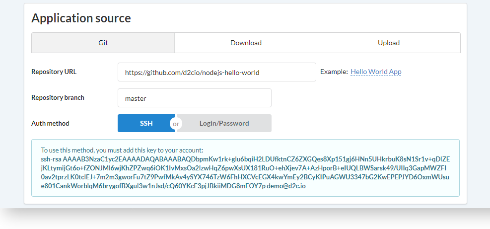
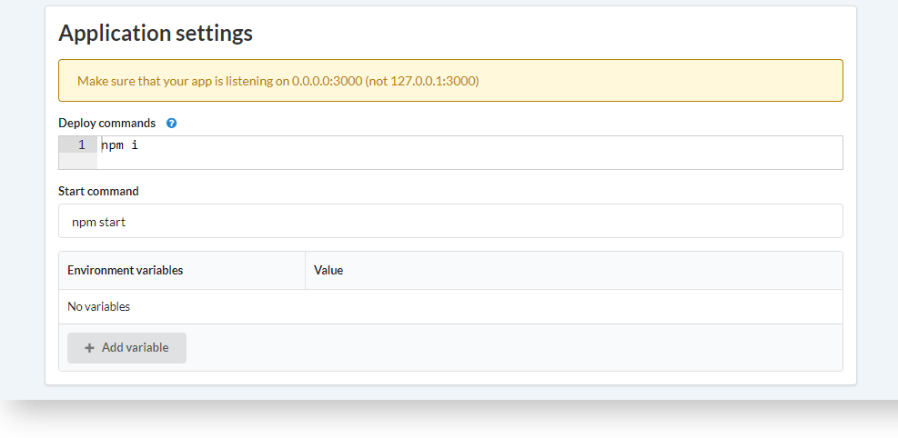
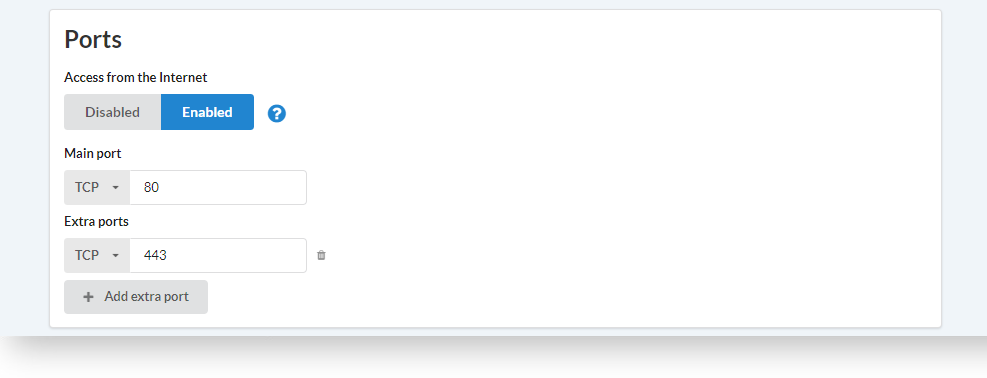

# Introduction

This article describes the process of creating services in D2C.
All definitions from creating (and editing) service page describes here.
There are some  definitions which should be explained.

## What you need to know before creating

### All services

- Service names should be unique across your account

- Directories, which should not be deleted after rebuild or redeploy (user generated content, plugins, logs, etc.) should be specified as Volumes in Persistent Data volumes block. Check sync if you want to [synchronize](/getting-started/containers/#synchronizing) files between all containers of service. Do not use it for database files.

- All services in a project are visible for each other inside. Access from the internet is disabled by default (except NGINX and HAProxy). You can open access from the Internet in "Ports" block.

### Application services

- If you use private repository, you should add an SSH key to your account ([GitHub](https://help.github.com/articles/adding-a-new-ssh-key-to-your-github-account/) and  [BitBucket](https://confluence.atlassian.com/bitbucket/add-an-ssh-key-to-an-account-302811853.html) manuals)

- Application should listen on 0.0.0.0:3000 (not 127.0.0.1:3000)

### Other services

- NGINX, NGINX-Static, HAProxy has enabled access from the Internet by default on port 80.

## Parameters and definitions

### Service settings

| Parameter     | Required     | Default     | Comments |
| :------------- | :------------- | :------------- |:------------- |
| Name                | Yes      |           | The name should be unique across your account. More about [Naming](/getting-started/services/#naming) |
| Configuration       | Yes      | StandAlone | Check [available configurations](/getting-started/services/#data-services)       |
| Version             | Yes      |           | You can specify any of [supported versions](/getting-started/services/#data-services) here. Usually, it is the most stable one by default       |
| Password/Root password | No    |           | Root password. Required for some configurations, e.g. MongoDB Replica Set |
| Username            | No       |           | Create a user during deploying service. Database will be created with the same name    |
| UserPassword        | No       |           | Password for the created database     |
| Preinstall          | No       |           | Additional software which you can want to install with your app    |
| Extensions and Pecl packages   | No |      | Additional modules for PHP-FPM and PHP-Apache services. |
| Global dependencies | No       |           | Commands for installing global dependencies of your service. Examples: **pip install**, **bundle install**, **apt-get install**, **npm install -g**   |

### Application source

Only for [Application](/getting-started/services/#application-services) and based on Docker

| Parameter               | Required         | Comments |
| :------------- | :------------- | :------------- |
| Git/Repository URL      | No | Example: [https://github.com/d2cio/nodejs-hello-world](https://github.com/d2cio/nodejs-hello-world) |
| Git \| branch\tag\commit  | No | You can specify branch, tag or commit. Examples: branch `master`, tag `v1.4`, commit `62d2272bbf7f1c6841c70dd09657df78836fda9c`  |
| Git/Auth method         | No | Choices: **SSH** (recommended), **Login/Password**. If you specify private repository and SSH, you should add an SSH key to your account ([GitHub](https://help.github.com/articles/adding-a-new-ssh-key-to-your-github-account/) and [BitBucket](https://confluence.atlassian.com/bitbucket/add-an-ssh-key-to-an-account-302811853.html) manuals) |
| Git/Repository login    | No | Login for base auth or for FTP server  |
| Git/Repository password | No | Password for base auth or for FTP server  |
| Download/URL            | No | Protocols: http, https, ftp.  File formats: **.tar.bz2**, **.tar.gz**, **.tar**, **.zip** Example: [https://wordpress.org/latest.tar.gz](https://wordpress.org/latest.tar.gz)  |
| Download/Login          | No | Login of FTP server  |
| Download/Password       | No | Password of FTP server  |
| Upload                  | No | You can upload an archive from your computer. Protocols: **http**, **https**, **ftp**.  File formats: **.tar.bz2**, **.tar.gz**, **.tar**, **.zip** Maximum size: **50MB** |

### Application settings

| Parameter                                 | Required       | Comments |
| :------------- |                            :------------- | :------------- |:------------- |
| Local dependencies and code's preparation | No     |  Commands for installing local dependencies and making your code ready to work. Examples: **npm install**, **composer install**, **bower install**, etc. or do some for preparation:  Examples: **gulp build**, **grunt build**, etc. |
| Start command                             | Yes    |  [Start commands](/getting-started/deployment/#running) of your application |
| Environment variables                     | No     |   |

### Ports

| Parameter                     | Required     | Comments |
| :------------- | :------------- | :------------- |:------------- |
| Access from the Internet      | Yes | All services in a project are [visible](/platform/private-network/) for each other inside.  If you want your service to be visible from the Internet, you should enable this option and define ports. Disabled by default for all services except **NGINX** and **HAProxy** |
| Ports\Protocol               | Yes  | Choices: UDP or TCP |
| Ports\Port                   | Yes  | Should be integer |

### Persistent data volumes

| Parameter                     | Required      | Comments |
| :------------- | :------------- | :------------- |
| Add volume                    | No  |  [Persistent data volumes](/getting-started/containers/#persistent-data) - directories, which should not be deleted after rebuild or redeploy (user generated content, plugins, logs, etc.) |
| Sync                          | No  | When you have more than one container you can need to sync data between volumes. Simply check the volumes which you want to sync |

### Configs

| Parameter      | Required      | Comments |
| :------------- | :------------- | :------------- |
| Add custom config  | No  | Some services have default config files (e.g. PHP-FPM, PHP-Apache, MongoDB). You can add your additional config files or edit/replace defaults. |

### Configure services

Only for NGINX, NGINX-Cluster and HAProxy. You can use automatically generated configs, edit them or use owns. [Domains and certificates](/platform/domains-and-certificates/) should be specified in this block.

| Parameter      | Required      | Default | Comments |
| :------------- | :------------- | :------------- | :------------- |
| Protocol            | Yes  | HTTP    | Choices: HTTP, HTTPS   |
| Mode                | Yes  | Proxy   | Choices: Proxy, uWSGI  |
| Domains             | No   |     | Domains and subdomains for a service |
| Serve static        | No   | Off |  |

### Select hosts

Select a host(s) you want an application to deploy to.

<!--
## How to create

### Data services

| [MongoDB]()     |   [MySQL/MariaDB/Percona]()   | [PostgreSQL]() | [Redis]()     |   [Crate]()   | [Memcached]() |   [ElasticSearch]()   |
| :------------- | :------------- | | :------------- | :------------- | | :------------- |

### Aplication services

| [Node.js]()     |   [Python]()   | [Go]() | [Ruby]()     |   [PHP-FPM]()   | [PHP-Apache]() |  
| :------------- | :------------- | | :------------- | :------------- | |

### Other services

| [NGINX]()     |   [NGINX-Cluster]()   | [NGINX-Static]() | [Docker]()     |   
| :------------- | :------------- | | :------------- |
-->
