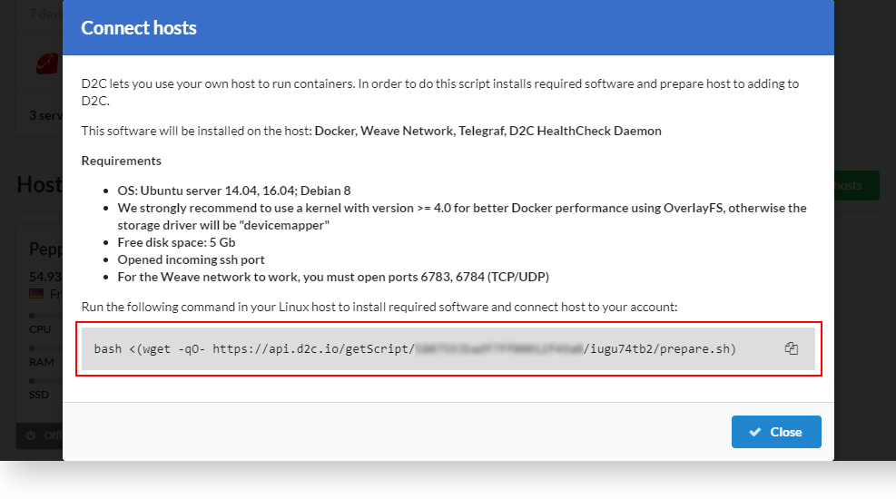
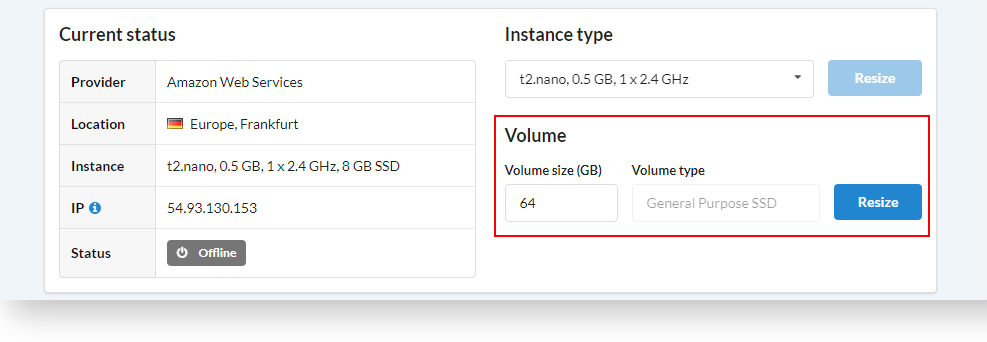
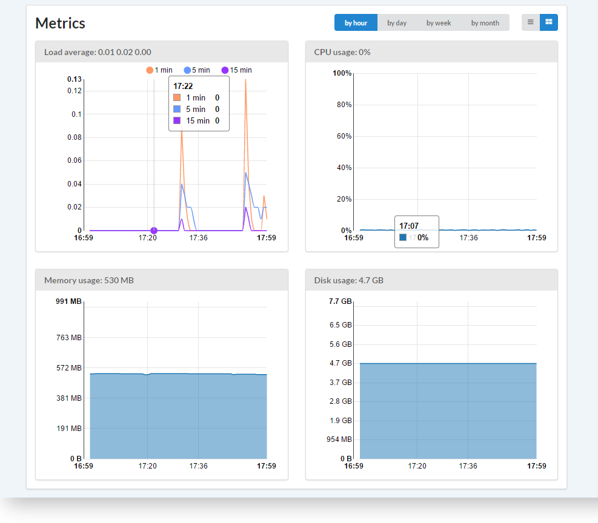
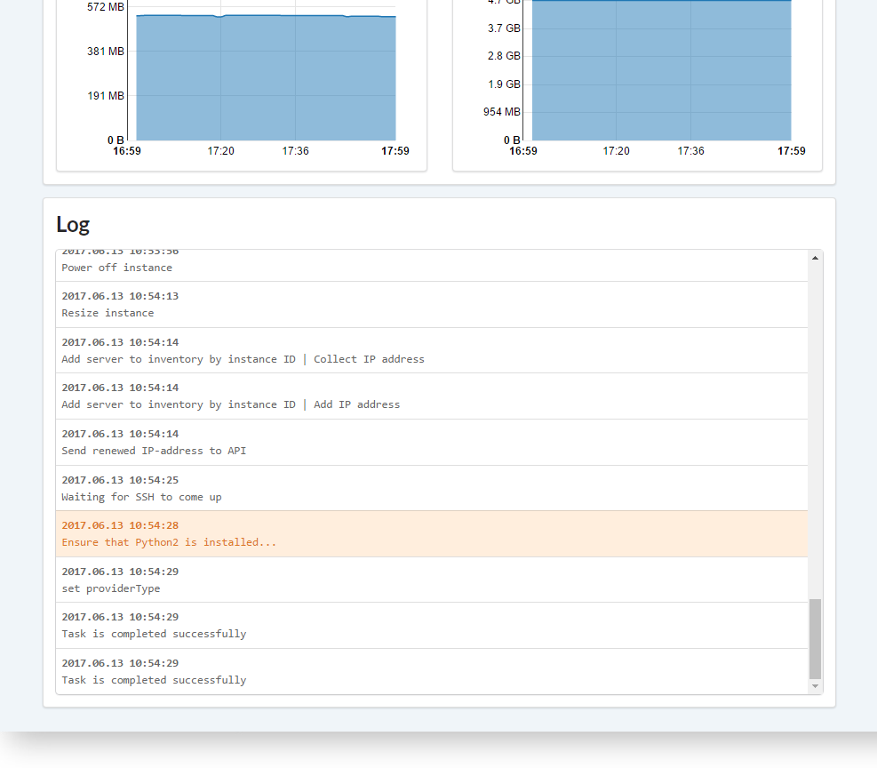

# Introduction

Services can not run without a server on the Internet. D2C can automatically provide servers for you. Just provide an access token for your preferred cloud provider, and D2C will create/destroy/resize servers as you need them. Keep in mind that the cloud provider will charge you for resource usage based on your payment plan. D2C does not provide its own computing resources – it automates the provisioning process at cloud providers.

If you want to deploy services on your own in-house servers or at cloud providers that D2C does not currently support, you can do so. We provide a script that checks whether your host complies with the requirements to be added to the D2C dashboard and be a part of your project.

Each host can be used for any [project](/getting-started/projects/) multiple times.

## Supported operation systems and requirements

When you create a host, we install **Ubuntu 16.04** on it.

When you **connect** your own host it should have:

- Ubuntu 14.04/16.04 or Debian 8/9.
- Kernel version >= 4.0 for better Docker performance using OverlayFS, otherwise, the storage driver will be "devicemapper"
- Free disk space: 5 Gb
- Opened incoming SSH port
- For the Weave network to work, you must open ports 6783, 6784 (TCP/UDP)
- hostname should be unique and cannot be named as "localhost"

!!! note

    D2C does not support hosts with installed Docker to prevent any configuration conflicts.

## How to connect own host

1. Sign in into your [D2C account](https://panel.d2c.io/account/signup).
2. Click **Connect host**
3. Copy the command

4. Connect to your host via **SSH**
5. Run the command you copied before

## Supported hosting providers

- Amazon Web Services ([how to link AWS](/getting-started/cloud-providers/#amazon-web-services))
- DigitalOcean ([how to link DigitalOcean](/getting-started/cloud-providers/#digital-ocean))
- Vultr ([how to link Vultr](/getting-started/cloud-providers/#vultr))

Will be available soon:

- Microsoft Azure

## What software will be installed on hosts?

- Docker
- Weave Network
- Telegraf
- D2C HealthCheck Daemon

## Actions

- Terminal
- Restart
- Stop (Start)
- Update system services (Docker, Weave, Telegraf)
- Destroy (+force destroy)
- [Instance Resize](/platform/scaling/#vertical-scaling) (only for cloud hosts)
- Volume Resize (for AWS hosts)

## AWS EBS

Amazon EC2 provides additional storage which calls [Amazon Elastic Block Storage](https://aws.amazon.com/ebs/?nc1=h_ls) (EBS). You can add additional EBS without stops of hosts.



## Demo hosts

You can create a demo host for testing the platform.
The configuration of demo hosts is t2.micro (1 GB, 1 x 2.4 GHz, 4GB SSD).
Region: N. Virginia, The United States

Demo host creates for one hour and will be destroyed (with all services and containers) after this time expired. You can create another one after that.

You can find a **+ Free demo host** button on the creating service page.

## Logs

Each host has logs (server logs).

The line which has ellipsis marks, in the end, can be opened with a mouse click.


## Connecting via SSH and SFTP

!!! note

    One public key should be used only once regardless of its type (SSH or SFTP). If you need to change a method of connection, you need to create another public key or replace the old one.

Open a terminal of a host and execute following commands using your keys.

[How to create SSH keys (BitBucket manual)](https://confluence.atlassian.com/bitbucketserver/creating-ssh-keys-776639788.html)

### For SSH

```bash
SSH_KEY="your public key"
echo $SSH_KEY >> ~/.ssh/authorized_keys
```

### For SFTP

```bash
SSH_KEY="your public key"
echo "restrict,command=\"sudo /usr/lib/openssh/sftp-server -d /ebs/containers\" $SSH_KEY" >> ~/.ssh/authorized_keys
```
## Services data

All data of services are stored in:
`/ebs/containers/serviceName`

For example, you can find sources in:
`/ebs/containers/serviceName/sources`

Backups:
`/ebs/containers/serviceName/backup`

### How the host page looks like




