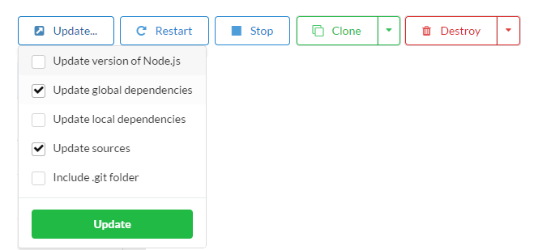

# Introduction
Service is an application deployed in D2C.

D2C executes your services/applications inside containers. We use Docker as our containerization platform. Each app is a separate container: web-app, database, load-balancer, etc. Docker is installed and configured on the hosts that are managed by D2C automatically. When you deploy your application, all the necessary files are delivered to the host, and container images are built locally on the host and then run by Docker daemon. D2C configures the environment automatically, so we do not recommend to add your current development boxes as managed hosts, to prevent any configuration conflicts.

Once you may deploy up to 50 containers (except services, which have their limitations).

## Naming

Each service has its **unique** name. We use them to create links like: **_servicename-www.accountID.at.d2c.io_** for your applications.

The name should starts with a letter and contain maximum 16 characters (initial, capital latin symbols or numbers).

Apps can reference each other by service name. It doesn't matter on which host the app is running – all private network intercommunication is transparent for applications.

## Native support

### Data services

| Name                                                   | Configuration               | Scalable         | Supported versions  |
| :-----------                                           | :-------------              | :------------- | | :------------- |
| [MongoDB](/getting-started/data-services/mongodb/)     | StandAlone or ReplicaSet    | Yes |              2.6, 3.0, 3.2, 3.4 |
| [MySQL](/getting-started/data-services/mysql/)         | StandAlone or MasterSlave   | Yes |              5.5, 5.6, 5.7, 8.0 |
| [MariaDB](/getting-started/data-services/mariadb/)     | StandAlone or MasterSlave   | Yes |              5.5, 10.0, 10.1, 10.2, 10.3 |
| [Percona](/getting-started/data-services/percona/)     | StandAlone or MasterSlave   | Yes |              5.5, 5.6, 5.7 |
| [PostgreSQL](/getting-started/data-services/postgresql/) | StandAlone or MasterSlave | Yes |              9.3, 9.4, 9.5, 9.6 |
| [Crate](/getting-started/data-services/crate/)         | StandAlone                  | No  |              0.57, 1.0 |
| [Redis](/getting-started/data-services/redis/)         |                             | Yes |              2.8, 3.0, 3.2 |
| [Memcached](/getting-started/data-services/memcached/) |                             | Yes |              1.4 |
| [ElasticSearch](/getting-started/data-services/elasticsearch/) | StandAlone          | No  |              1.4, 1.5, 1.6, 1.7, 2.0, 2.1, 2.2, 2.3, 2.4, 5.0, 5.1, 5.2, 5.3 |

### Application services

| Name                                                    | Scalable      | Supported versions |
| :-----------      | :-------------| :-------------      |
| [Node.js](/getting-started/app-services/nodejs/)        | Yes           | 0.12, 4, 6, 7, 8   |
| [Python](/getting-started/app-services/python/)         | Yes           | 2.7, 3.3, 3.4, 3.5, 3.6 |
| [Go](/getting-started/app-services/golang/)             | Yes           | 1.6, 1.7, 1.8  |
| [Ruby](/getting-started/app-services/ruby/)             | Yes           | 1.9, 2.0, 2.1, 2.2, 2.3, 2.4 |
| [PHP-FPM](/getting-started/app-services/php-fpm/)       | Yes           | 5.6, 7.1 |
| [APACHE+PHP](/getting-started/app-services/php-apache/) | Yes           | 5.6, 7.1 |

### Other services

| Name                                                                                        | Scalable      | Supported versions |
| :-----------      | :-------------| :-------------     |
| [NGINX](/getting-started/other-services/nginx/)                                             | No            | 1.9, 1.10, 1.11, 1.12, 1.13 |
| [NGINX-Cluster](/getting-started/other-services/nginx-cluster/)                             | Yes           | 1.9, 1.10, 1.11, 1.12, 1.13 |
| [NGINX-Static](/getting-started/other-services/nginx-static/)                               | Yes           | 1.9, 1.10, 1.11, 1.12, 1.13 |
| [HAProxy](/getting-started/other-services/haproxy/)                                         | No            | 1.7 |
| [Docker](/getting-started/other-services/docker-service/) (Services based on Docker Images) | Yes           |  |

## Actions

Actions which have all services:

- Update version
- Restart
- Stop (Start)
- Clone
- Destroy (+force destroy)

All **application services** have smart update feature which you may choose separately or combine with each other:

- Update version (data and other services have only this one)
- Update global dependencies
- Update local dependencies
- Update sources
- Include .git folder

## System Logs

Each service has system logs (deploy logs).

The line which has elision marks, in the end, can be opened with a mouse click.

Messages of building images consist stdout, and it also can be shown.

### Host the service page look like

